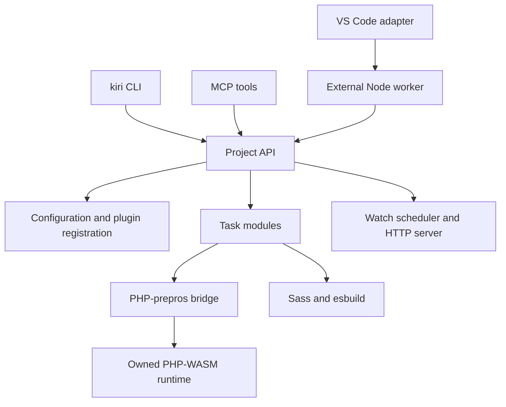

# Internal execution model

This guide describes the current source implementation. Start with [CONTEXT.md](CONTEXT.md) for the package inventory, [API.md](API.md) for the embedding contract, or [USER-GUIDE.md](USER-GUIDE.md) for a first site. Historical rationale belongs in [DECISIONS.md](DECISIONS.md); unresolved defects belong in [BUGS.md](BUGS.md).

## Entry points and ownership

The [core entry point](../packages/kirigami/index.js) owns operation ordering and aggregates results. CLI commands own terminal presentation. MCP translates results into text content. VS Code stages runtime dependencies and starts a separate Node process whose working directory is the site directory before importing core; see [the extension guide](EXTENSION-VSCODE.md).

Core configuration and script modules capture `process.cwd()` at module evaluation. Plugin hooks and commands use shared SDK registries. Multiple `Project` objects do not provide independent projects: use a separate process per site, and set its working directory before importing core. Operations must be awaited sequentially.

## Configuration and reload

The [configuration loader](../packages/kirigami/bin/config.js) reads `kirigami.yaml` through struct-walker, resolving nested file references. Ajv validates the resulting object against the bundled schema; imperative checks then resolve paths, verify files, and supply defaults. The compiled schema validator and resolved configuration have separate caches.

`Project.reload()` performs these steps:

1. Mark the project unloaded and discard its current configuration/plugin list.
2. Clear the core configuration cache.
3. Await PHP-prepros runtime reset, then clear collected plugin PHP includes.
4. Read the configuration and validate its schema, built-in tasks, and paths.
5. Re-register active plugins, including their custom task types; then collect every `commands:register` hook result, routed through `registerCommand()`.
6. Collect every `tasks:register` hook result and append it to `config.tasks`.
7. Strictly validate every configured task (project's own and plugin-injected alike), then mark the project loaded.

The [plugin loader](../packages/kirigami/bin/libs/plugins.js) resolves packages from the project first, then from its own installation. It checks package metadata and option schemas before awaiting `register(options, { config, name })`. Reload resets shared hook, command, and task-type registrations before registering active plugins again; Node's JavaScript module cache remains intact. Restart the process after editing plugin implementation code.

`validate()` only refreshes core configuration. It does not refresh PHP state or plugin registrations and is not a substitute for reload before executing changed configuration. Existing watch handles also retain their original rules: close them and create new handles when configuration changes.

## Build and export ordering

| Operation | Ordered work |
|---|---|
| `build()` | `before-build` scripts; forced implicit `render-all` when `prepros` is present; configured tasks |
| `export()` | Validate source/destination separation; `before-export`; `before-build`; implicit rendering; forced `copy-files`; configured tasks; `after-export` |
| `runTask(name)` | Find one task and force it; no build triggers or other tasks |

Built-in task modules are imported from `bin/tasks/<type>.js`. A normal plugin
may register additional types through the SDK task-type registry, and inject
actual task entries — same shape as a `tasks:` YAML entry — through the SDK's
`tasks:register` hook; reload() appends those onto `config.tasks` right after
plugins register, before strict validation, so they go through the exact same
path as a project's own tasks. Initial configuration parsing validates
built-ins and defers unknown types; after plugins register, a strict pass
rejects any type still unresolved and runs its optional validator. Build/export
skip a task unless its definition sets `canbuild` or the task sets `force`;
watch eligibility is separately controlled by `canwatch` and `getWatcher`.

Each trigger runs matching configured scripts sequentially — a project's `kirigami.yaml` `scripts:` entries first, then any plugin-registered script (via the SDK's `scripts:register` hook) with the same trigger and a name not already covered by a `scripts:` entry — and stops at the first unsuccessful result. Task loops also stop at the first unsuccessful result. Unexpected exceptions can still reject the operation. Completed work is not rolled back.

[`runscript()`](../packages/kirigami/bin/libs/runscript.js) resolves a name to a PHP file: a project's own `scripts/<name>.php` first, else a plugin's `scripts:register` registration for that name. Plugin registrations are collected lazily and cached for the lifetime of the loaded project, invalidated by `reload()` the same way `prepros:php` include paths are.

Export is not a build into an entirely isolated directory: the implicit PHP task renders in the source tree, applies HTML hooks there, and generates sitemap output before the dist task copies public files. Later configured tasks receive the export destination. [The dist task](../packages/kirigami/bin/tasks/dist.js) rejects overlapping lexical or canonical source/destination paths, then empties the dedicated destination. It filters private/source files and applies `export.ignore`; it does not provide a transactional publish or restore old output after a later failure.

## PHP rendering boundary

[The prepros task](../packages/kirigami/bin/tasks/prepros.js) collects `prepros:php` hook results once per include-cache lifetime. It passes those include paths to PHP-prepros, then applies `prepros:html` as a waterfall to generated HTML. A whole-site render also runs sitemap generation and combines diagnostics/files from both operations.

[PHP-prepros](../packages/php-prepros/src/prepros.js) lazily loads its own configuration and owns a disposable PHP-WASM instance. It mounts framework code at `/prepros` and source data under `/project`, prepares PHP configuration, and uses `auto_prepend_file` to load the framework bootstrap. Mounting filters file extensions; it is not an unrestricted mirror of the host filesystem.

PHP work and resets share a promise queue covering mounting, execution, and result extraction. Reset waits behind active PHP work, disposes the instance, and drops cached root/configuration state. This protects the PHP boundary only; it does not serialize whole `Project` operations or isolate SDK registries.

PHP diagnostics go to stderr rather than generated HTML. Task results can contain warnings, stderr, and debug output in addition to success/error and produced files. The renderer copies reported outputs back to the host; PHP virtual paths and host paths are not interchangeable.

The lower-level PHP-WASM package also provides shared cached runtimes for direct consumers. Its network runtime bridges WASM sockets through a local proxy to Node TCP connections and injects Node's CA roots. Because libcurl waits on `poll()`, the network runtime replaces that synchronous syscall with one that yields to Node's event loop (woken by WebSocket activity); end-to-end WASM HTTPS is covered by the TLS regression test. See [runtime documentation](../packages/php-wasm/README.md) for disposal, extension discovery, and current limits.

## Watching and serving

[The watch engine](../packages/kirigami/bin/libs/watchengine.js) constructs a local task list without mutating configured tasks. It watches glob base directories, filters events, and batches callbacks per rule with a default 150 ms debounce. Callback failures are contained so later batches can run. Closing stops incoming work, discards pending batches, and awaits active callbacks.

PHP structural events refresh mounts, remove obsolete known page outputs, and rebuild pages plus sitemap. This is scoped cleanup, not arbitrary deletion of everything absent from a source listing. Watch rules are constructed when a handle starts; both `watch()` and `serve()` first await `build()` unless `initialBuild: false` is supplied. A failed initial build rejects before server/watch resources are allocated.

[The development server](../packages/kirigami/bin/libs/devserver.js) serves generated files and uses Server-Sent Events for browser reloads. Successful Sass callbacks request stylesheet replacement; other successful rules request a page reload. Failed rebuilds do not trigger reload. Private/source paths and canonical link targets are checked; JavaScript and source maps remain available for development. This differs from export filtering.

`serve()` waits for watcher readiness and cleans up the HTTP server if startup fails. Its returned `close()` closes watchers and then the server. An embedder owns that handle and must await cleanup.

## Where to verify changes

Use [the contributor guide](../.github/CONTRIBUTING.md#development-setup) for test commands. Core tests cover path safety, minimal rendering, reload, watch lifecycle, and server errors; CLI tests cover scaffolding and installation; the relocated extension test exercises the packaged runtime layout. The recorded Windows/Node 26 run is not evidence of Linux, Node 24, or published VSIX compatibility.
